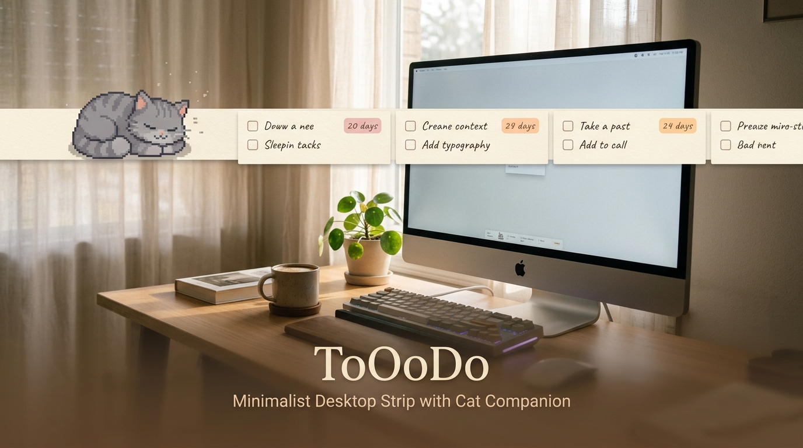

# 🌿 ToOoDo

  

> Windows masaüstüyle tam bütünleşen, göz yormayan doğal kağıt/kırtasiye estetiğine sahip, sevimli pixel art animasyonlu kedi arkadaşı içeren, ultra hafif (**~18 MB RAM**, **%0.0 CPU**) yatay yapılacaklar şeridi.

---

### ⚡ Hızlı İndir ve Kullan (Kurulum Gerektirmez)

ToOoDo'yu kullanmak için bilgisayarınızda Python veya herhangi bir ek kütüphane olmasına **gerek yoktur**. Hazır derlenmiş `.exe` dosyasını indirip çift tıklayarak saniyeler içinde kullanmaya başlayabilirsiniz:

[-2ea44f?style=for-the-badge&logo=windows&logoColor=white)](https://github.com/adamkarga/ToOoDo/releases/latest/download/ToOoDo.exe)

> 🎯 **Tek Dosya, Sıfır Zahmet:** İndirdiğiniz `ToOoDo.exe` dosyasını Masaüstünüze veya dilediğiniz bir klasöre koyup çalıştırmanız yeterlidir.
> - Kurulum sihirbazı veya internet bağlantısı gerektirmez.
> - Alternatif olarak GitHub sayfasının sağ tarafındaki **[Releases (Sürümler)](https://github.com/adamkarga/ToOoDo/releases)** sekmesinden de her zaman en son `ToOoDo.exe` dosyasını edinebilirsiniz.

---

## ✨ Öne Çıkan Özellikler

1. **🐱 Canlı Pixel Art Kedi Arkadaşı (Cat Companion):**
   - **Sol Köşede Uyuklama:** Şeridin en solunda kıvrılıp tatlı tatlı uyur, nefes alır ve ara sıra esner.
   - **Şerit İçi Devriye (Wander):** Zaman zaman uyanıp çubuğun içinde sakin adımlarla gezinir, oturup etrafa bakar, patisini yalayıp temizlenir veya kaşınır.
   - **Fare Takibi & Koşma:** Fare imleci ToOoDo çubuğunun üzerine geldiğinde hemen uyanır, fareye doğru heyecanla koşar, farenin yanında durup iki ayağı üstüne kalkar (`hind legs`) veya fareye doğru pati atar!
   - **Geciken Görev Uyarısı:** Süresi geçen veya acil bir görev olduğunda o kartın yanına yürüyüp patisiyle dokunarak seni uyarır.
   - **Görevler Bittiğinde Huzurlu Uyku:** Tüm işler bittiğinde gerinir ve ekmek somunu (loaf) pozisyonunda derin uykuya dalar.
   - **Menüden Renk Seçimi:** Sağdaki `⋮` menüsünden **"🐱 Sevimli Kedi"** alt menüsüne girerek:
     - `✓ Kül Grisi (Duman)` *(Varsayılan)*
     - `  Sarman Tekir (Garfield)`
     - `  Pamuk Beyazı (Gümüş)`
     seçenekleri arasında anında geçiş yapabilir veya kediyi istediğiniz an açıp kapatabilirsiniz.

2. **🎨 Gece & Defter Temaları (Themes):**
   - **Açık Parşömen (`paper`):** Krem/fildişi kağıt dokusu ve kurşun kalem zarafeti.
   - **Koyu Kraft / Gece Modu (`dark_kraft`):** Göz yormayan koyu kömür kraft dokusu, sıcak mat bej metinler.
   - Tüm pencereler ve menüler temayla kusursuz uyum sağlar.

3. **⌨️ Global Hızlı Not Kısayolu (`Alt + Shift + T`):**
   - Hangi programda olursanız olun klavyeden `Alt + Shift + T` tuşlarına bastığınızda şerit hemen odaklanır ve minimal Görev Ekle penceresi açılır.

4. **🐾 Sistem Tepsisi (Tray Icon - Minik Pati):**
   - Windows bildirim alanında (saatin yanında) minik pati ikonu yerleşir.
   - **Sol Tık:** Şeridi gizler / gösterir (Odaklanma modu).
   - **Sağ Tık:** Hızlı erişim menüsü.

5. **🌐 Çoklu Dil & Otomatik Dil Algılama (Multi-Language & Auto-Detect):**
   - Bilgisayara kurulduğunda ve çalıştırıldığında Windows'un yerel görüntüleme dilini (`GetUserDefaultUILanguage`) otomatik olarak tespit eder (Türkçe, English, Deutsch, Español).

6. **📌 Windows AppBar Entegrasyonu (Akıllı Masaüstü Rezervasyonu):**
   - Çubuk **"Ekranın En Üstü"** konumundayken Windows Çalışma Alanını (`WorkArea`) otomatik ve anında rezerve eder.
   - **Google Chrome, Edge, Word gibi tüm uygulamaları tam ekran yaptığınızda pencereler ToOoDo şeridinin alt sınırına kenetlenir.**

7. **✓ Görünür Onay Kutucuğu `[ ]` & Geçmiş (`✓`):**
   - Canlı yeşil onay animasyonu ve tamamlanan maddeleri inceleyebileceğiniz / geri alabileceğiniz arşiv penceresi.

8. **🚀 Windows Başlangıcında Otomatik Açılma:**
   - Menüden tek tıkla açılıp kapatılabilir.

---

## 🚀 Başlatma

- 🌟 **Doğrudan Bağımsız Uygulama Olarak (Tavsiye Edilen):**
  **`ToOoDo.exe`** dosyasına çift tıklayın! Python veya herhangi bir ek kütüphane kurulumu gerektirmez. İstediğiniz bilgisayara kopyalayıp hemen çalıştırabilirsiniz.
- 🐍 **Geliştirici / Python Olarak:**
  **`Baslat.bat`** dosyasına çift tıklayabilirsiniz.

---

## 👤 Geliştirici & İletişim

- 🌐 **Kişisel Blog:** [adamkarga.net](http://adamkarga.net/)
- 🐦 **X (Twitter):** [@adamkarga_](https://x.com/adamkarga_)
